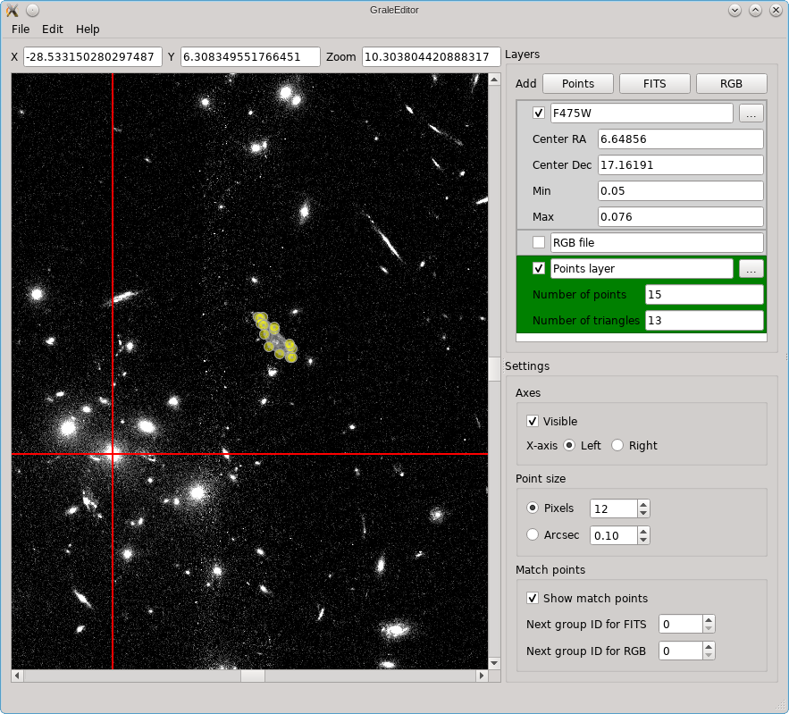

.. _graleeditor:

GRALE Editor
============

**Note:** this page is far from complete, the most complete description of
what it can do can be found in the :ref:`tutorial <tut-graleeditor>`.

The GRALE Editor is a Graphical User Interface (GUI) tool to help create
and visualize input that's going to be used for gravitational lens inversions.

Layers
------

There are three types of layers:

 - Points layer: various kinds of point-based information can be defined in
   such a layer, e.g. points of a specific image or null space points and
   triangles. The information from such layers can be stored in a file
   describing :class:`images data <grale.images.ImagesData>`, which can
   be used when running a lens inversion.

 - FITS layer: for reference, FITS files can be shown and the XY-coordinate
   system can be centered on a specific point in the FITS image. 

 - RGB layer: if a PNG or JPG already exists that, for example, combines 
   several FITS files, this can be shown as well. This can subsequently be
   aligned to a FITS layer that's been loaded.

Multiple layers of each type can exist at the same time, but only one layer
can be specified as the active layer. The active layer will be indicated
by a green color (see image below) and depending on which layer is active,
mouse and keyboard controls will have different effects. While there are
three layers in the example below, the RGB layer is not shown, which is
indicated by the unchecked box. Different layers are shown on top of each other,
the one shown first (from top to bottom) in the GUI is the one that's
drawn first.

General controls
----------------

When moving the mouse over the part of the GUI in which the layers are
actually displayed, you'll see the values behind the 'X' and 'Y' fields
change. Their units are arc seconds. If you enter a different value and
press enter, that coordinate will be shown in the center of either X or
Y direction.

To zoom in/out you can either specify a different zoom level in the
'Zoom' field, or you can press ``Control`` and use the mouse wheel. 
Pressing the keys 0 to 9 will set the zoom to :math:`2^n`. Without 
pressing ``Control``, you'll just move the entire area that's displayed
up or down, and when 'Alt' is displayed the area will move left/right.

Two very useful general controls are:

 - undo: ``Control``-Z
 - redo: ``Shift``-``Control``-Z

FITS layer
----------

The XY axes (shown in red when visible) will be aligned with the right ascension
(RA) and declination (dec) axes from the FITS file, but the point that's used as
the center can be specified: either by entering the appropriate coordinates in
the 'Center RA' and 'Center Dec' boxes, or by making sure the layer is active and
double clicking on the point that should be used as the center.
The values in the FITS file are shown on a linear (gray)scale, where the boundaries
can be specified in the 'Min' and 'Max' fields. A right click on a FITS layer will
show a dialog in which these properties can be changed as well.

If a FITS layer is active, a single mouse click will show a cross with a number
below it. This label is based on the 'Next group ID for FITS' setting, but can
always be changed into something else. These points will be used as reference
points when an RGB layer needs to be transformed to match the FITS layer
(see next section).

RGB layer
---------

Points layer
^^^^^^^^^^^^

TODO: for now these are just some very basic notes, mainly for myself. Needs
much cleaning up.

Command line
------------

Usage::

    grale_editor [arguments]

Is:
 - ``--nocheck`` : when exiting, don't ask to save changes if there are any

Starts with:
 - ``--zoom:`` : sets zoom level
 - ``--imgdataname:`` : sets latest images data file name, can be useful to set export name
 - ``--imgplane:`` : pre-loads the following file to be used in the back-projection related
   tools. This file should be a pickled ImagePlane or MultiImagePlane

Argument ends with 

 - .json: loads scene if first argument, adds to existing scene if not the 
   first argument
 - .png or .jpg: adds image layer with this image
 - .fits: adds fits layer for this file
 - .imgdat or .imgdata: adds the information for the images data file.
   By default, all images are added into a single image layer. By
   specifying a number followed by a comma and then the file name, that
   specific image is loaded into an image layer. If the number is negative,
   each image in the file is added as a separate image layer.
 
If the argument is just ``.``, an empty points layer is added.

Keyboard and mouse controls
---------------------------

Single click:
   - mouse on point: toggles point selection
   - adds point if points layer is active, match point if FITS/image 
     layer is active. If 'ctrl' is pressed, automatically starts
     adding a label
   - clears selected points unless ctrl is pressed

If points layer active, and left mouse press and move:
   - if not on point: draws line along which points
     will be added when mouse is no longer held,
     triangles will be added as well. Interior points
     will be included in triangulation
   - if on point, that point will be moved. If control
     is pressed as well, other selected points will
     be moved as well

Right-click and move: select points/match points

Right-click:
 - on point: bring up dialog allowing you to set specific
   coordinates, time delay info and point group name
 - on FITS image: bring up dialog allowing you to change center and
   min/max value for the brightness scale

Double click point/match point: allows to edit point group name or match 
point name

Double click on one of a set of selected points: create triangulation

Double click elsewhere:
 - If FITS layer active: center on that point
 - If image layer active: match image to visible FITS layer
 - If points layer active: start contour finder based on what's visible
   around the clicked position. 

Control-delete: remove selected triangles

Shift-delete: remove selected points, and affected triangles

Control-C: copy

Control-X: cut

Control-Z: undo

Control-L: detect contour levels around central position (cfr double click)

Control-E: export visible images to images data file

Shift-Control-Z: redo

Double click on layer in list widget: make that layer active

Right click on layer in list widget: popup menu with options

Just 'c': center on selected points

Number 0-9:
 - No 'control' or 'alt': set zoom to 2^number
 - With 'control, but no 'alt': center point layer
