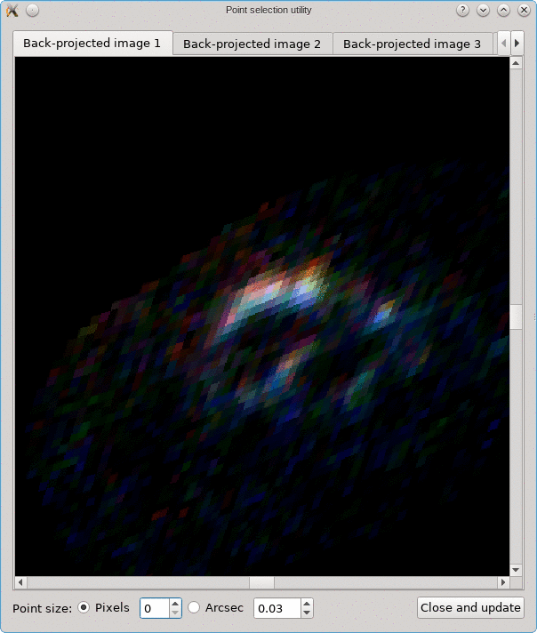

.. _tutorial:

Tutorial
========

After following the :ref:`installation` instructions, you'll obviously be
eager to get started with modeling and inversion of gravitational lens systems.
Instead of having to go through all available modules, classes and functions
first, this tutorial aims to familiarize you with the core ideas and procedures.
You can also take a look at various :ref:`notebooks` to see them in
action immediately.

Modeling and plotting
---------------------

Modeling gravitational lenses
^^^^^^^^^^^^^^^^^^^^^^^^^^^^^

One of the core parts of the software is the :class:`GravitationalLens <grale.lenses.GravitationalLens>`
class. You won't create an instance of this class directly, that's prohibited, instead
you'll create a lens model using one of the derived classes, like :class:`SISLens <grale.lenses.SISLens>`
for lensing by a Singular Isothermal Sphere, or :class:`NFWLens <grale.lenses.NFWLens>` for
lensing by a mass distribution with a spherical Navarro-Frenk-White profile. 
All available models are shown in the documentation of the :mod:`grale.lenses` module;
the :class:`GravitationalLens <grale.lenses.GravitationalLens>` class contains the
methods that you can call for every one of the the available models. You can also
import a `LensTool <https://projets.lam.fr/projects/lenstool/wiki>`_ model using the
:func:`createLensFromLenstoolFile <grale.lenses.createLensFromLenstoolFile>` function.

The constructor of a specific lens model always takes two arguments. The first is the
angular diameter distance to the lens, the second describes the parameters for the
lens model. To convert the redshift of a lens to an angular diameter distance,
you can use an instance of the :class:`Cosmology <grale.cosmology.Cosmology>`
class, which destribes a particular cosmological model. Most often, various
quantities are expressed in SI units. In :mod:`grale.constants` there are various
constants that help you express values in these units, or to convert values to
other units.

The following example illustrates the creation of a lens model:

.. literalinclude:: ex/example_lens.py
   :language: python
   :lines: 1-17

In this example, we created a single SIS lens, which is centered at the origin.
There are many other available models, which are also typically centered at the
origin. To make it possible to use a different center, and to even combine multiple
lens models into a single, more complex model, we can use a :class:`CompositeLens <grale.lenses.CompositeLens>`.
Continuing from the previous example, we could change the center of the SIS lens,
and add a Singular Isothermal Ellipsoid at another location, even rotating it
over a specific angle (as the :class:`documentation <grale.lenses.CompositeLens>`
mentions, this angle is interpreted as degrees).

.. literalinclude:: ex/example_lens.py
   :language: python
   :lines: 19-28

You can save save a lens model to a file using the aptly named :func:`save <grale.lenses.GravitationalLens.save>`
function, and load the file again using the :func:`load <grale.lenses.GravitationalLens.load>` 
function. The binary data that is loaded or saved, can also be used directly through
the :func:`fromBytes <grale.lenses.GravitationalLens.fromBytes>` and
:func:`toBytes <grale.lenses.GravitationalLens.toBytes>` functions. This can help
to bypass having to write a lens model to a file first, e.g. when downloading
a model from the web, as the following example illustrates by loading the model
obtained by inverting CL0024:

.. literalinclude:: ex/example_lens_dl.py
   :language: python

Plotting lens systems
^^^^^^^^^^^^^^^^^^^^^

The :mod:`plotutil <grale.plotutil>` module contains various functions to create plots, 
using `matplotlib <https://matplotlib.org/>`_, `gnuplot <http://gnuplot.info/>`_
or even an interactive 3D plot when using a `Jupyter <http://jupyter.org/>`_
notebook.

Renderers and feedback
,,,,,,,,,,,,,,,,,,,,,,

By default, calculations will be done on a single CPU core. For a complex lens
model, this can become quite slow, and various so called :mod:`renderers <grale.renderers>`
are available to speed up this process. There's one that can use the different
cores on your computer, and even one that can use different computers when the
`MPI <https://en.wikipedia.org/wiki/Message_Passing_Interface>`_ system (e.g.
on a supercomputer) is available. For some calculations, `OpenCL <https://www.khronos.org/opencl/>`_
can use your GPU to speed up calculations, but this is not available for all
lens types. To get some feedback during such longer calculations, the
:mod:`feedback <grale.feedback>` module can be useful.

Many of the functions in the :mod:`plotutil <grale.plotutil>` module accept
`renderer` and `feedbackObject` arguments. While you can specify them in every
function used, it will probably be less cumbersome to simply set the default
to be used, using :func:`setDefaultMassRenderer <grale.renderers.setDefaultMassRenderer>`,
:func:`setDefaultLensPlaneRenderer <grale.renderers.setDefaultLensPlaneRenderer>`
and :func:`setDefaultFeedback <grale.feedback.setDefaultFeedback>`, for 
example:

.. literalinclude:: ex/example_rendererdefaults.py
   :language: python

Single lens plane
,,,,,,,,,,,,,,,,,

In the case of a single lens plane, we can create a plot of the image
plane and projected mass density with e.g. the :func:`plotImagePlane <grale.plotutil.plotImagePlane>`
:func:`plotDensity <grale.plotutil.plotDensity>` functions. The lens model
can be passed as the first argument, which will cause a relevant area to
be :func:`estimated <grale.plotutil.estimatePlotScale>`, which in turn will
be used for the plots. In the image plane case, a :math:`D_{ds}/D_s` fraction
of 1 will be assumed.

To avoid using radians as the unit on the plot axes, we can specify a particular
unit to be used with the `angularUnit` argument of the functions.
Alternatively, instead of specifying this argument with every single function, we
can also set the default unit using :func:`setDefaultAngularUnit <grale.plotutil.setDefaultAngularUnit>`
function. Note that this only converts values when plotting, it does not change
the way function parameters are interpreted for example.

The code below illustrates this, for the ``combLens`` model that was created in
a previous example:

.. literalinclude:: ex/example_plot.py
   :language: python
   :lines: 2-

This produces a matplotlib plot containing the two panels shown below, of which the left one
shows the image plane (for :math:`D_{ds}/D_s = 1`) and the right one shows the
density. In the left panel, a red line is used for the critical line and a blue
one for the caustic. In the right panel,
the `vmax` argument of the underlying `imshow <https://matplotlib.org/api/_as_gen/matplotlib.pyplot.imshow.html>`_
function is used to cut off the color scale at :math:`10 kg/m^2` to better show
the combination of the circularly symmetric SIS lens and the elliptic SIE lens.

.. plot:: ex/example_plot.py

To better control what to plot, e.g. the specific area or source distances,
instead of using a lens model as the first argument we can create a 
:class:`LensInfo <grale.plotutil.LensInfo>` instance for this situation.
Apart from more control about what to plot, this instance will also be used
to cache results, so that creating a similar plot may not require everything
to be recalculated. This is especially useful as the lens model becomes more
complex. When specifying a lens instead of a :class:`LensInfo <grale.plotutil.LensInfo>`
object, internally a ``LensInfo`` instance is still generated, and in fact, this
instance is typically returned by the functions. So in our previous example
we could have obtained this object in the following way:

.. code-block:: python

    lensInfo = plotutil.plotImagePlane(combLens)

The following example provides a more extensive example for plotting image
plane and mass density information, for the CL0024 lens from an earlier example.
In this example, we also set the renderers to ``threads``, so that all available
cores on a computer would be used. The plots that are generated by this example
are shown below the code (which continues where the CL0024 example left off):

.. literalinclude:: ex/example_plot_cl0024.py
   :language: python
   :lines: 2-

.. plot:: ex/example_plot_cl0024.py

The :class:`LensInfo <grale.plotutil.LensInfo>` object stores various 
properties, like the :class:`ImagePlane <grale.images.ImagePlane>` and
:class:`LensPlane <grale.images.LensPlane>` instances that were calculated,
as well as the density map. In the example below, we use the 
:func:`plotDensityContours <grale.plotutil.plotDensityContours>` function
to create a contour map of the projected mass density of the lens.
The result is shown in the panel on the left.
The center and right panels of the same figure show the circularly averaged mass 
density profile and integrated mass profile respectively, using the 
:func:`plotAverageDensityProfile <grale.plotutil.plotAverageDensityProfile>`
and :func:`plotIntegratedMassProfile <grale.plotutil.plotIntegratedMassProfile>`
functions. 

.. literalinclude:: ex/example_plot_cl0024_b.py
   :language: python
   :lines: 10-

.. plot:: ex/example_plot_cl0024_b.py

Being able to plot the critical lines and caustics for a lensing scenario is
of course nice, but typically we're also interested in an image configuration
that corresponds to a specific source position. For this, we can create a
source shape using a class derived from :class:`SourceImage <grale.images.SourceImage>`,
and pass this to e.g. the :func:`plotImagePlane <grale.plotutil.plotImagePlane>`
function. Note that actually a list of source shapes needs to be specified.
The example below illustrates this:

.. literalinclude:: ex/example_plot_cl0024_c.py
   :language: python
   :lines: 10-

.. plot:: ex/example_plot_cl0024_c.py

You could even create an animation to see what the effect is of different
source positions, using :class:`Animation <grale.plotutil.Animation>` or
:class:`NotebookAnimation <grale.plotutil.NotebookAnimation>`. 
Because the deflection calculations are cached, calculating the lens effect
at different source positions or even different source redshifts can be
done relatively quickly. The example
below is created in the notebook `fittest.ipynb <_static/fittest.ipynb>`_,
and shows the lens effect of a very strange mass distribution on a circular
source.

.. raw:: html

   <video src="_static/gralesource.mp4" width="50%" controls></video>

When creating a plot for a single source, or several sources at the same
distance/redshift, the last set angular diameter distances (or source 
redshift) is used. To plot multiple sources, the list of source shapes
needs to become a list of dictionaries containing the source shapes as
well as the distance information. The code below illustrates this.

.. literalinclude:: ex/example_plot_cl0024_d.py
   :language: python
   :lines: 22-

.. plot:: ex/example_plot_cl0024_d.py

If you don't just want to plot the mass density of a gravitational lens,
but you want to look at the difference between lenses, or even the standard
deviation of a whole set of lenses, the :class:`DensInfo <grale.plotutil.DensInfo>`
class can come in handy. It accepts a 2D NumPy array of values, where each value is
considered to be the mass density at a specific point. These points are arranged regularly
between a bottom-left and top-right corner that also need to be specified.
For a specific lens, this kind of information can be obtained using a call to
:func:`LensInfo.getDensityPoints <grale.plotutil.LensInfo.getDensityPoints>`.

In the example below, we use the CL0024 model again. This is actualy an average
of several different individual lens models, and apart from the average mass
density associated to the lens, we're typically also interested in the way these
individual models vary. The standard deviation of all these maps can give us
some insight into this, and it's precisely this what is calculated in the
example:

.. literalinclude:: ex/example_plot_stddev.py
   :language: python
   :lines: 2-

.. plot:: ex/example_plot_stddev.py

Multiple lens planes
,,,,,,,,,,,,,,,,,,,,

Using a :class:`LensInfo <grale.plotutil.LensInfo>` object, you can also
simulate lensing by multiple gravitational lenses as different redshifts.
Instead of the :class:`LensPlane <grale.images.LensPlane>` and
:class:`ImagePlane <grale.images.ImagePlane>` classes, internally now
:class:`MultiLensPlane <grale.images.MultiLensPlane>` and
:class:`MultiImagePlane <grale.images.MultiImagePlane>` will be used.

For the `lens` parameter of the ``LensInfo`` object, you now need
to specify a list of tuples, where each of the tuples contains a
lens model and a redshift. To specify which cosmology must be used
to convert the redshifts to angular diameter distances, you can either
set the `cosmology` argument, or install a default cosmological model
using :func:`setDefaultCosmology <grale.cosmology.setDefaultCosmology>`
The example below illustrates this, more elaborate examples can be
found in the :ref:`notebooks` section.

.. literalinclude:: ex/example_plot_multiplane.py
   :language: python

.. plot:: ex/example_plot_multiplane.py

Regarding density plots, this cannot be done when the ``LensInfo``
object has been initialized for a multi-lensplane scenario. If you
want information about the mass distributions of the individual lenses,
you have to obtain the information for the individual lenses, and
combine them manually. This way, you can decide yourself whether
or not you need to take into account the lens effect of the foreground
lens, as is illustrated in the following example, which continues
from the SIS and SIE lenses in the previous one:

.. literalinclude:: ex/example_plot_multiplane_dens.py
   :language: python
   :lines: 39-

.. plot:: ex/example_plot_multiplane_dens.py

Modeling arbitrary mass distributions
^^^^^^^^^^^^^^^^^^^^^^^^^^^^^^^^^^^^^

There are several reasons you might want to be able to calculate the
lens effect for a mass distribution of which you don't know how to
expand it in terms of the basic :mod:`GravitationalLens <grale.lenses>`
derived classes: perhaps the lens shape is some analytic model and
either the lens effect is not known, or an appropriate model is
not available in Grale. Another reason might be that you want to know
the lens effect for some pixelized distribution, e.g. the light that's
observed in a cluster and stored in a FITS file.

For the pixelized case, in principle you could use the 
:class:`MultipleSquareLens <grale.lenses.MultipleSquareLens>` model
and add the effect for each individual pixel. This will certainly work,
and depending on the size of the pixels will create a good approximation
to the true, non-pixelized distribution. However, the number of pixels will become
very large rather quickly, causing the calculations for e.g. the
image plane (which itself is subdivided into a large number of locations)
to become very slow, even when you can accelerate the calculations
by using one of the :mod:`renderers <grale.renderers>`. Also, the final
model will lack some smoothness that may be desired, after all it is
built up from square pixels.

To reduce the complexity of the calculation and still obtain a good
model, it is possible to create a fit to the mass distribution using
Plummer basis functions of varying sizes. To do so, first you 
create a :mod:`grid <grale.grid>` that's based on the density you'd
like to model. Typically, this grid will be created so that the regions
that contain more mass will have a more narrow subdivision. Then,
using this grid as input, the :func:`fitMultiplePlummerLens <grale.grid.fitMultiplePlummerLens>`
function is called, which assigns Plummer basis functions to the
grid cells (with a width proportional to the cell size), fit the weights
of these basis functions to obtain a close match to the target density,
and finally returns the result as a :class:`MultiplePlummerLens <grale.lenses.MultiplePlummerLens>`
lens model.

The target density needs to be supplied to the ``fitMultiplePlummerLens``
function by supplying a callback function. Depending on what you'd like
to model, the :mod:`GridFunction <grale.gridfunction>` class can be
useful, for example to use a FITS file as input with the 
:func:`GridFunction.createFromFITS <grale.gridfunction.GridFunction.createFromFITS>`
function.

Examples of this fitting procedure can be found in the
`fittest.ipynb <_static/fittest.ipynb>`_ notebook.

How much the subdivision grid needs to be refined will depend on the
complexity of the mass distribution you're trying to model, and will
require some experimentation. In the various :func:`createSubdivisionGrid <grale.grid.createSubdivisionGrid>`-like
functions with which the grid will typically be created, there's an
argument called `keepLarger`, which defaults to ``False``. In my experience,
fitting is somewhat improved by setting this to ``True``; this causes
the original grid cell to be present in the subdivision grid even when
it's subdivided further.

Inversion
---------

While creating gravitational lens simulations is interesting in its own
right, usually one is far more interested in performing a gravitational lens
inversion. Below you can find some information to help get you started,
several `examples <https://github.com/j0r1/GRALE2/tree/master/inversion_examples>`_
are included in the source code archive to illustrate the procedure.

The origins of the inversion procedure start with 
`2006MNRAS.367.1209L <https://ui.adsabs.harvard.edu/abs/2006MNRAS.367.1209L/abstract>`_,
but over the years many additions were made, for example to include
so-called null-space information (where no images are present), or to
include time delay information. A recent overview of the entire procedure
can be found in 
`2020MNRAS.494.3253L <https://ui.adsabs.harvard.edu/abs/2020MNRAS.494.3253L/abstract>`_.

Overview
^^^^^^^^

You need to specify a few things to be able to start the inversion procedure:

 - the observations, usually multiple images of several sources, but could
   also include e.g. null space data, or weak lensing measurements;
 - a set of basis functions (type, location and initial shape/mass)
   for the lensing mass distribution, of which the weights need to be 
   determined to fit the observations specified as the input.

A genetic algorithm (GA) is then used as the optimization procedure, to
look for the weights of these basis functions. The GA looks *only* for
appropriate weights, so e.g. the position or orientation of a basis function
will not change.

To be able to model quite arbitrary mass distributions, one typically
starts with basis functions (the default type is a :class:`Plummer <grale.lenses.PlummerLens>`
model) laid out in a regular grid pattern. Then, based on a first run
of the GA, and therefore a first estimate of the lensing mass distribution,
one creates a grid in which cells are subdivided more finely in regions
where more mass is detected. This is illustated in the figure below:

.. plot:: ex/example_subdiv.py

Each cell will again correspond to a basis function of which the weight
needs to be optimized, and the GA is executed again to perform this optimization.
This subdivision procedure is typically repeated a number of times, with
more and more subdivisions/basisfunctions, until the added complexity
no longer provides an improvement in the retrieved solution.

Because no particular shape of the mass distribution is assumed, other
than the fact that it can be be built up using many simple basis functions,
the method is often termed 'free-form' or 'non-parametric'. You could
also place specific models, e.g. :class:`SIE <grale.lenses.SIELens>` models, at the
location of observed galaxies, and optimize their weights to fit the
observations. This is not unlike so-called parametric methods, but note that
the GA can only optimize the weights of the basis functions, it cannot
alter their location or rotation angle for example.

With an :class:`InversionWorkSpace <grale.inversion.InversionWorkSpace>`
object, it is quite straightforward to execute the needed steps:

 - first, you create an `InversionWorkSpace` where you specify the
   redshift of the lens, the size of region that will be used for the
   grid-based procedure, and the center of this region;

 - then, you :func:`add <grale.inversion.InversionWorkSpace.addImageDataToList>`
   contraints from observations to the workspace, specified as 
   :class:`ImagesData <grale.images.ImagesData>` objects;

 - you create a grid to lay out the basis functions, either a
   :func:`uniform <grale.inversion.InversionWorkSpace.setUniformGrid>`
   one, or a :func:`subdivision grid <grale.inversion.InversionWorkSpace.setSubdivisionGrid>`
   based on a previous lens model. Alternatively, you can also 
   manually :func:`add basis functions <grale.inversion.InversionWorkSpace.addBasisFunctions>`;

 - you :func:`run the GA <grale.inversion.InversionWorkSpace.invert>`
   to determine the weights of the basis functions, resulting in
   a mass model.

Based on the resulting mass model, you can create a new grid, start
the GA again, etc. This is the main procedure you'll find in the included
`examples <https://github.com/j0r1/GRALE2/tree/master/inversion_examples>`_.

Creating an InversionWorkSpace
^^^^^^^^^^^^^^^^^^^^^^^^^^^^^^

In the procedure outlined above, during several refinement steps always the
same obvervational input data is used, and typically the same region is used
that is subdivided into a number of grid cells. To keep track of these
common settings, as well as to perform some other operations, an
:class:`InversionWorkSpace <grale.inversion.InversionWorkSpace>` instance
is created. 

For example, if a gravitational lens is located at a redshift of 0.4, 
the strong lensing mass should be retrieved in a 250 arcsec :sup:`2`
region, and a particular :class:`cosmological model <grale.cosmology.Cosmology>` 
is to be used, you'd do something like this::

   import grale.inversion as inversion
   import grale.cosmology as cosmology
   from grale.constants import *

   z_lens = 0.4
   cosm = cosmology.Cosmology(0.7, 0.27, 0, 0.73)
   iws = inversion.InversionWorkSpace(z_lens, 250*ANGLE_ARCSEC,
                                      cosmology=cosm)

Instead of specifying the cosmology in the constructor, you could also
first :func:`set a default <grale.cosmology.setDefaultCosmology>` one,
after which you can just omit the model in the construction of the
workspace, i.e. something like::

   cosm = cosmology.Cosmology(0.7, 0.27, 0, 0.73)
   cosmology.setDefaultCosmology(cosm)

   iws = inversion.InversionWorkSpace(z_lens, 250*ANGLE_ARCSEC)

Adding images
^^^^^^^^^^^^^

Next, we need to specify what the observational constraints are,
for example multiply imaged point sources. For such point image
data, it is common to have it listed in a text file, and there
exists a helper function :func:`readInputImagesFile <grale.images.readInputImagesFile>`
to process such a text file. It returns a list of dictionaries
with information about the redshift, the source identifier, and an
:class:`ImagesData <grale.images.ImagesData>` object (describing the
actual images), one for each multiply imaged source.
Depending on the format of such a text file, it is likely that you
need to specify how each line should be analyzed, the documentation
lists some examples. If no further processing is required, the
call would be something like this::

   import grale.images as images

   imgList = images.readInputImagesFile("inputpoints.txt", True)

For each image in the list, we then need to call the workspace's
:func:`addImageDataToList <grale.inversion.InversionWorkSpace.addImageDataToList>`.
In that call, we not only tell the workspace what the relevant redshift
is, but also what the type is of the data. In this case the data describes
point images, but it could also describe extended images or null space
information for example. In our example this would become::

   for i in imgList:
      iws.addImageDataToList(i["imgdata"], i["z"], "pointimages")

For extended images it's also possible to read all the points from a
text file, but it's unlikely that such a file is available. Usually,
based on one or more FITS files of the sky region, you can use
the :ref:`GRALE Editor <tut-graleeditor>` tool to create these data sets,
and save them to a file. Again, there would be a different file for
each multiply imaged (extended) source. You could load and add these 
to the workspace like this::

   src1 = images.ImagesData.load("source1.imgdata")
   src2 = images.ImagesData.load("source2.imgdata")

   iws.addImageDataToList(src1, 2.5, "extendedimages")
   iws.addImageDataToList(src2, 1.5, "extendedimages")

A null space grid can be created using the helper function
:func:`createGridTriangles <grale.images.createGridTriangles>`,
or you could create it in the :ref:`GRALE Editor <tut-graleeditor>`. For
point images, the grid is typically a simple grid, but for extended
images the irrelevant regions should be cut out (the regions of
the images themselves, or a bright cluster galaxy for example).

To allow the inversion algorithm to figure out which null space data
belongs to which source, the data must be specified right after the
images themselves. For point images, as no holes are cut out there,
the same grid can typically be used for each source, and adding the
data could become something like this::

   bottomLeft = [ -200*ANGLE_ARCSEC, -200*ANGLE_ARCSEC]
   topRight = [ 200*ANGLE_ARCSEC, 200*ANGLE_ARCSEC]
   nullData = images.createGridTriangles(bottomLeft, topRight, 48, 48)

   for i in imgList:
      iws.addImageDataToList(i["imgdata"], i["z"], "pointimages")
      iws.addImageDataToList(nullData, i["z"], "pointnullgrid")

For extended images, as different regions *are* cut out for different
sources, a different file will need to be loaded. The code would then
become::

   src1 = images.ImagesData.load("source1.imgdata")
   null1 = images.ImagesData.load("null1.imgdata")
   src2 = images.ImagesData.load("source2.imgdata")
   null2 = images.ImagesData.load("null2.imgdata")

   iws.addImageDataToList(src1, 2.5, "extendedimages")
   iws.addImageDataToList(null1, 2.5, "extendednullgrid")
   iws.addImageDataToList(src2, 1.5, "extendedimages")
   iws.addImageDataToList(null2, 1.5, "extendednullgrid")

More information about the different types of input data that can
be specified this way, can be found in the `usage <./usage_general.html>`_
documentation.

**Whatever you do, before continuing, make sure that your input
data makes sense!** Create plots using
:func:`plotImagesData <grale.plotutil.plotImagesData>` or load
the data in the GRALE Editor.

Creating a grid
^^^^^^^^^^^^^^^
As explained before, the usual way to start a lens inversion is to
lay out basis functions in a regular grid pattern. In a next step,
lens plane basis functions (by default Plummer lenses) will be initialized to
have a width that's proportional to the size of a cell. To set up
such a regular grid, use :func:`setUniformGrid <grale.inversion.InversionWorkSpace.setUniformGrid>`,
for example::

   iws.setUniformGrid(15)

This would produce a regular 15x15 grid, with cells that cover the
region specified at the workspace's construction time. As the
documentation shows, by default some randomness will be applied to 
the grid center.

In case you already have a lens model, for example the result from
using this uniform grid (let's call it ``lens1``), you could 
create a new grid with cells that are finer in regions where 
there's more mass. This can be done with a call to
:func:`setSubdivisionGrid <grale.inversion.InversionWorkSpace.setSubdivisionGrid>`,
where you specify a range in which the number of cells should lie. 
As the 15x15 grid produces 225 cells, in a next step often the range 
from 300 to 400 is used, for example::

   iws.setSubdivisionGrid(lens1, 300, 400)

How many cells exactly this procedure would produce, depends on
the mass distribution. In a next iteration, with the optimization 
result from using this grid, you could for example create a new 
one as follows::

   iws.setSubdivisionGrid(lens2, 500, 600)

The grid that is created this way, can be obtained using 
:func:`InversionWorkSpace.getGrid <grale.inversion.InversionWorkSpace.getGrid>`,
and can be visualized easily using :func:`plotSubdivisionGrid<grale.plotutil.plotSubdivisionGrid>`.
This creates plots such as the ones shown above.

Running the inversion
^^^^^^^^^^^^^^^^^^^^^

The grid created in the previous step, determines the layout and widths
of the basis functions. A call to :func:`invert <grale.inversion.InversionWorkSpace.invert>`
determines the initial masses of these basis functions, and
subsequently starts the GA to figure out the weights of the basis
functions that are compatible with the observational constraints
provided to the workspace. In this `invert` call, a
so called 'inverter' can be specified, which allows you to speed
up the calculations using e.g. MPI. Alternatively, you can set a
default inverter using :func:`setDefaultInverter <grale.inversion.setDefaultInverter>`
and omit the parameter from the `invert` call. This would then
yield code like the following::

   inversion.setDefaultInverter("mpi")
   lens1, fitness, fitdesc = iws.invert(512)

The number 512 in the `invert` call, specifies the number of genomes/chromosomes/individuals
in the population of the GA. The function returns the :class:`GravitationalLens <grale.lenses.GravitationalLens>`
based lens model that is reconstructed, consisting of the basis functions 
with weights determined by the GA. This model can be 
:func:`saved <grale.lenses.GravitationalLens.save>` and later 
:func:`loaded <grale.lenses.GravitationalLens.load>` for further analysis.
Apart from this model, the `invert` call also returns the fitness value
that this model had in the GA, together with the type of the fitness measure
that was used (e.g `extendedimageoverlap` or `pointimageoverlap` depending
on the type of the provided input).

To assign initial masses to the basis functions, the mass of the
lens is estimated roughly from the provided images. If desired or needed,
this can be overridden using the `invert` call's ``massScale`` argument.
The default strategy is to simply divide this mass by the number of
grid cells, and assign each grid cell's basis function that share of the
mass. This will automatically place more mass in the more finely subdivided
regions. In case you feel this places too much mass in those regions, you
can set the ``rescaleBasisFunctions`` parameter to ``True``, causing these
weights to rescaled according to the size of the cell. In practice, the
default setting seems to provide better solutions faster.

Full control over which basis functions are placed where can be obtained
by using e.g. :func:`addBasisFunctions <grale.inversion.InversionWorkSpace.addBasisFunctions>`.
This allows you to use any lens model as a basis function. Instead of
`invert`, then the :func:`invertBasisFunctions <grale.inversion.InversionWorkSpace.invertBasisFunctions>`
call is required. As a side note, the `invert` call internally actually
calls this function once the basis functions have been derived from the
grid.

The ``massScale`` parameter also serves another purpose. Each genome in
the GA's population contains the weights of the basis functions for a
particular trial solution. As described in the articles, these weights
actually only determine the *shape* of the mass distribution. An overall 
scale factor will still be searched for, so that the resulting mass
distribution yields the best fitness value for that genome. This scale factor
will be probed in such a way that the total mass lies in a certain range 
around ``massScale``. The range can be controlled with the parameter
``massScaleSearchType``.

A special kind of basis function that can be enabled, is a mass sheet
basis function. It's special in the sense that it doesn't take part in
the scaling procedure mentioned above. To enable this, set the
``sheetSearch`` parameter to ``"genome"`` (the default is ``"nosheet"``).

To avoid having to specify the same arguments over and over in the `invert`
calls, you can use 
:func:`setDefaultInversionArguments <grale.inversion.InversionWorkSpace.setDefaultInversionArguments>`
to set the default values.

In case multiple types of constraints are used, e.g. multiple images as well
as null space information, a multi-objective GA will be used. Having multiple
constraints, and hence multiple fitness values, implies that there's in general
no longer a single best genome in each generation of the population, 
but a `non-dominated set`. 
The default behavior of the `invert` call is still to return a single
solution based on a priority of the individual fitness measures (can be 
controlled using the `priority` parameters, described in the
`usage <./usage_general.html>`_ documentation). To return the final non-dominated
set instead, set the ``returnNds`` parameter to ``True``. 

Processing the results
^^^^^^^^^^^^^^^^^^^^^^

The `invert` call returns a :class:`GravitationalLens <grale.lenses.GravitationalLens>`
based lens model, which you can then further analyze as described earlier in the
tutorial. For example, you can create plots of the mass distribution, or of the
critial lines and caustics. 

The workspace's function
:func:`backProject <grale.inversion.InversionWorkSpace.backProject>` can be
used to project the images back onto their respective source planes, 
using a particular lens model (doesn't even have to be one resulting from
the inversion routine). It returns
a list of `ImagesData` instances that have their point coordinates replaced
by the back-projected coordinates. Together with the
:func:`plotImagesData <grale.plotutil.plotImagesData>` function you could
create the plot below, showing the input images as well as the
back-projected ones for the first two lens models from the routine outlined
previously:

.. plot:: ex/example_backproj.py

The code to create such a plot looks like this:

.. literalinclude:: ex/example_backproj.py
   :language: python
   :lines: 15-34

With respect to re-lensing the source estimates, the functions
:func:`calculateRMS <grale.util.calculateRMS>` and
:func:`calculateImagePredictions <grale.util.calculateImagePredictions>`
may be of help.
These function reduce each observed image to a single point, which is
trivial for point images. In case you're dealing with extended images,
you can control how this needs to be done. 

In case you'd like to create a source shape from the backprojected images, the
:func:`createSourceFromImagesData <grale.images.createSourceFromImagesData>`
function may be of interest to you. The source shape this creates is just a simple 
filled polygon however, in case you'd like to see the actual lens effect using
one of the back-projected images as the source, you can calculate this with
the :ref:`GRALE Editor <tut-graleeditor>`.

You can always calculate the fitness value(s) a specific lens model (again,
doesn't need to be one that resulted from the inversion procedure) has
using :func:`calculateFitness <grale.inversion.InversionWorkSpace.calculateFitness>`.
For a lens model that was returned using the `invert` procedure, this should yield
roughly the same value as was returned by that function. Not precisely, as the
`calculateFitness` function uses code that's much different from the optimized
code in the inversion routine. The calculations can also take quite some time.

Note on reproducibility
^^^^^^^^^^^^^^^^^^^^^^^

In the procedure that's outlined above, there are actually two random number
generators at work, which is good to know if you'd like to be able to reproduce
your results exactly.

The first one is used in the creation of the grid: as
mentioned above, by default some randomness is added to the position of the
grid center. This randomness comes from Python's
`random module <https://docs.python.org/3/library/random.html>`_, so if
you want to make sure that the same grids are generated in different runs,
you can set the random number generator's seed using
`random.seed <https://docs.python.org/3/library/random.html#random.seed>`_.
Alternatively, you can save the random number generator's state using
`random.getstate <https://docs.python.org/3/library/random.html#random.getstate>`_
which you can then restore if needed using
`random.setstate <https://docs.python.org/3/library/random.html#random.setstate>`_.

Instead of working with Python's random number generator, you can also simply
save the generated grids. A grid can be obtained using the workspace's
:func:`getGrid <grale.inversion.InversionWorkSpace.getGrid>` function and can be
set again using :func:`setGrid <grale.inversion.InversionWorkSpace.setGrid>`.
To save or load very general Python objects, the easiest way is to
`pickle/unpickle <https://docs.python.org/3/library/pickle.html>`_ them.

To perform the inversion, so to run the GA, the Python code will actually
start a different program (written in C++), which has its own random number
generator. In the output of that program, you'll see a line like the following,
which allows you to find out which seed was used::

   GAMESSAGESTR:RNG SEED: 1581199847

To force a specific seed to be used when this inversion program is executed,
you can set the ``GRALE_DEBUG_SEED`` environment variable. For example,
to make sure that seed 12345 is used, one would run the code as follows::

   import os
   os.environ["GRALE_DEBUG_SEED"] = "12345"
   lens1, fitness, fitdesc = iws.invert(512)

Note that with this approach, the same environment variable will still be set
for other `invert` calls as well, which means that the same seed will be
used! To reproduce the results from other runs, you'd need to set
the seeds those different `invert` calls used, for example::

   os.environ["GRALE_DEBUG_SEED"] = "12345"
   lens1, fitness, fitdesc = iws.invert(512)

   iws.setSubdivisionGrid(lens1, 300, 400)
   
   os.environ["GRALE_DEBUG_SEED"] = "45678"
   lens2, fitness, fitdesc = iws.invert(512)

So, if you create an inversion script and want to be able to reproduce the
run exactly, you could print the random number generator's state at the
start, and perform a number of `invert` calls further on in the script,
as follows::

   import random
   print("RNG State:")
   print(random.getstate())

   ...

   iws = inversion.InversionWorkSpace( ... )

   ...

   iws.setUniformGrid(15)
   lens1, fitness, fitdesc = iws.invert(512)
   lens1.save("inv1.lensdata")

   iws.setSubdivisionGrid(lens1, 300, 400)
   lens2, fitness, fitdesc = iws.invert(512)
   lens2.save("inv2.lensdata")

   iws.setSubdivisionGrid(lens2, 500, 600)
   lens3, fitness, fitdesc = iws.invert(512)
   lens3.save("inv3.lensdata")

To be able to recreate this run exactly, you need to be able to inspect
all the output this script generated, so let's assume you've got that
in a file somehow. In that file, you can find the random number generator's
state (right below ``RNG State``, which we printed in the script) as well
as the seeds that were used in the external inversion program (those
``GAMESSAGESTR:RNG SEED:`` lines). Depending on that information, the
script to recreate the run would look something like this::

   import random
   random.setstate((3, (2869744549, 791801109, ... ), None))

   ...

   iws = inversion.InversionWorkSpace( ... )

   ...

   iws.setUniformGrid(15)
   os.environ["GRALE_DEBUG_SEED"] = "2551823485"
   lens1, fitness, fitdesc = iws.invert(512)
   lens1.save("inv1.lensdata")

   iws.setSubdivisionGrid(lens1, 300, 400)
   os.environ["GRALE_DEBUG_SEED"] = "1662455239"
   lens2, fitness, fitdesc = iws.invert(512)
   lens2.save("inv2.lensdata")

   iws.setSubdivisionGrid(lens2, 500, 600)
   os.environ["GRALE_DEBUG_SEED"] = "440472084"
   lens3, fitness, fitdesc = iws.invert(512)
   lens3.save("inv3.lensdata")

.. _tut-graleeditor:

GRALE Editor
------------

The :ref:`GRALE Editor <graleeditor>` is a Graphical User Interface (GUI) program
to be able to prepare or inspect input files for an inversion, to back-project 
observed images (from FITS data or an RGB image file), to re-lens a back-projected 
image and to look for corresponding points in back-projected images.

It is quite similar in concept as the older version, but quite different in design
internally, and hopefully easier to use. A major advantage (at least in my view)
is the ability to **undo** (Ctrl-Z, or Cmd-Z on OS X) and **redo** (Shift-Ctrl-Z,
or Shift-Cmd-Z on OS X).

Layers & points
^^^^^^^^^^^^^^^

The screenshots below show a number of the core ideas. The main viewport, the left part
of each figure, shows a coordinate system on which points can be placed. Near the
top of the window, the coordinates (arcsec) corresponding to the mouse pointer's
position are shown, as well as the current zoom. Zooming in/out can easily be
done by holding Ctrl/Cmd and using the mouse wheel. To base
the coordinates on an actual observation, you can load a FITS file as the background.
In the options on the right for this FITS file, you can see that a certain RA/dec
coordinate is placed at the center of the coordinate system in the main viewport.

The editor does not provide a way to combine several FITS files from different
wavelengths into a color image, but you can import a color image (e.g. a PNG or
JPG file) into the editor. You can then match points in the color image to points
in the underlying FITS file; that's what happened in this picture and that's what
those red circles are a remnant of.

In the picture above, you can also see some yellow dots, although they are not
well resolved. After zooming in however you can see that several points as well
as a triangulation outline one of the images in Abell 3827.

In this example you can see that there are three kinds of layers: for a FITS
file, for an RGB image and for points (that can be exported to an
:class:`ImagesData <grale.images.ImagesData>` file). While in this example
there is one layer of each, there can be as many as needed, and you
can change their order by dragging them around in that 'Layers' part of the
window. The first layer will be
rendered first, that's why the RGB layer is drawn on top of the FITS layer
and hides a big part of the FITS image. With the checkboxes you can control
whether or not a layer is shown.

The actions you perform (keyboard/mouse) will have a different effect depending
on which layer is active. In the screenshots above, the points layer is the
active one, indicated by a dark green color; to change which layer is active,
just double click on that layer (I find it easiest to double click just to their
left of the checkbox). A left-mouse button click
places a point, holding Ctrl/Cmd at the same time will immediately allow you
to start typing to add a label/name to the point. To add/change the label
later on, just double click on the point. The size of the point and
label can be controlled using the option in the right part of the window, where
you can opt either to show the point as a fixed number of pixels, or in arcsec
units, corresponding to the zoom of the viewport.

For a points layer, this point is a yellow dot, for a FITS layer this is a
red cross, and for an RGB layer this is a red circle. The use of the points
in FITS/RGB layers, is to be able to mark corresponding points in these layers
by giving them the same label. To make this procedure somewhat easier, a label
(a number) will be added automatically to these points, based on the 'Next
group ID' settings on the right. You can always change the label if desired,
of course.

Background FITS & matched RGB
^^^^^^^^^^^^^^^^^^^^^^^^^^^^^

To create such a background FITS and matching RGB image, you start by adding
a FITS layer. To specify which point in the FITS image corresponds to the center
of the coordinate system, you can double click on that point. Alternatively, 
you can simply enter the RA/dec coordinates in the layer's info; by default
they have been set to the central pixel's coordinates.

When this layer is active, and you perform a single left mouse click, a red
cross will be added with a label that's specified in the bottom-left of the
user interface ('Next group ID for FITS'). The screenshot below shows the
viewport where four such points have been added, roughly at the center of
four prominent galaxies.

To align an RGB image to this FITS file, first we need to add a new RGB layer,
containing e.g. a PNG or JPG file. Initially, the image will just be shown centered in the
viewport, will not be aligned yet with the FITS file, even having a different
scale. To be able to calculate the necessary transformation, we need to
select the same galaxies, which will be shown as red circles. For the example 
we're using, this looks something like the image below.

To be able to match the RGB layer to the FITS layer, it's imperative that the
corresponding points have the same label. For a first alignment, it's not that
important that the exact positions match, for now we just want the alignment
to be roughly ok. To perform the necessary calculations and align the RGB
layer to the FITS layer, just make sure that the RGB layer is active and
double click in the main viewport (doesn't matter where you click). In our
example, this yields the following:

To see how well the alignment worked, you can just hide/show the RGB layer
so that you can compare it to the underlying FITS image. Since we only
roughly selected those galaxies, the alignment will not be that good yet.
To get a better alignment, we need to get those points to point to corresponding
positions more accurately. To move a point, you can just drag it.

My approach is usually to just forget about those initial points, and add new
ones that lie near the borders of the images. Furthermore, to
make it easier to pin-point a feature in the FITS/RGB files, I typically look
for some very small galaxies that are visible in both images. To delete points, 
first select them: a single point is selected by clicking on it, by holding
Ctrl/Cmd you can add points to the selection, and by holding Shift you can
select a range. Pressing Shift+Delete then removes the selected points.
With the new matching points, make sure that the RGB layer is active, and double
click again to re-calculate the alignment.

Extended images & null space
^^^^^^^^^^^^^^^^^^^^^^^^^^^^

While double clicking on a FITS or RGB layer is related to the background images,
double clicking on a point in the viewport when a points layer is active, starts
the contour finder tool. In the example below, a left double click on the
blueish galaxy was performed (with a points layer being active). The slider then
allows you to select a specific contour, indicated by a curved green line. By 
default, the dialog box is actually
a bit smaller, but if you press the three dots ``...`` next to the slider, you'll
see various options that are related to how the contours are determined.

The square region that will be used for the contour finder, is indicated by the
green box, the width of which can be set using the aptly named `Width` parameter.
For this region, internally a square gray scale image is generated, subdivided
in the specified number of pixels both horizontally and vertically. This internal
image is blurred using the specified width, and in the resulting blurred/smoothed image contours
are determined. Note that all these operations happen on the image as it is shown,
irrespective of whether that's a FITS layer, an RGB layer or an overlap. If it's
a FITS layer of which the min/max parameters are set in such a way that everything
is shown as white for example, then no meaningful contours will be detected. The
tool works with how the viewport is shown.

If you press `Ok`, then the selected contour will be traced with a number of 
points and these will be triangulated. The resulting points and triangles will
be added to the active points layer. The screenshot below shows an example.
If there would already be points inside the contour, in the active layer, then
these will be included in determining the triangulation.

If the contour tool does not work well enough, you can always simply draw the
contour yourself. Just hold the left mouse button and move the mouse pointer
to start drawing. The screenshot below illustrates this:

When you release the mouse button, points are added according to the
contour that was drawn, and a triangulation is provided. All points and
triangles are added to the active points layer. As can be seen in the
example below, if a point in the active layer is internal to the contour,
it is used in the triangulation.

You can also follow a completely manual approach: first just add individual
points using a single left click each time. Then, select the points for which
you'd like to add a triangulation. To select points, you can select an entire
region by keeping the Shift key pressed, holding down the left mouse button
and select a rectangular range. Alternatively, you can select multiple points
individually by keeping Ctrl (or Cmd on OS X) pressed down, and clicking on
the existing points individually. In either case, a selected point will turn
blue instead of yellow. The figure on the left shown this. To create a triangulation
from these points, just double click on one of the selected points. This in
turn would produce the situation on the right.

To delete points or triangles, first select them as before. Then, to delete
both points and triangles press Shift+Delete. To only delete the selected triangles
but not points that could be selected as well, press Ctrl+Delete.

If you right-click on a point, a dialog is shown with various properties
of that point; an example is shown below. You could change the coordinates
somewhat if you like, provide a label/group name to the point, and possibly 
a time delay. In the current inversion procedure, the time delays are 
expected as a number of days.

If you only want to provide a label/group name to a point, to indicate which points 
correspond to each other in different images, you can also just double click on a 
point that's not selected (so a yellow point, not a blue one). You'll then 
see a dotted rectangle in which you can type a label, as the figure below shows.

In the ``Edit`` menu, there's an option called ``Create null grid``, with which
you can create null space grids for use in inversions with point images or extended
images. For extended images, the inversion routine assumes a grid in which the
regions where images are observed, or where extra images could be observed, are
cut out. For inversions with point images, a very simple grid is typically used,
there's no need to cut out anything.

The tool is the same for both cases, and it will decide if regions need to be cut
out based on the visible points layers. So if you want to create a simple null
grid, without removing any regions, make sure that all points layers are hidden
(using the checkbox next to the layer name). Assuming that this case is fairly
straightforward, let's focus on the case in which we do want to remove certain
regions.

In the screenshot below, four extended images were drawn (very roughly, just for 
this example). In the editor, there are two main ways to specify *different* images.
A very simple one, that is not used in the example below, is to have a points layer
for each image. Another approach is to have several images in the same layer,
but then triangulations are needed to be able to detect that there are in fact
*multiple* images in that layer. If there are only points, there's no way to automatically
detect which points belong together in one image, but if triangulations are present
then these can be used to figure out which points belong to which image.

When the tool is started from the ``Edit`` menu, a dialog box appears, as you can
see below. There you can specify the size of the grid, as well as its center, and
the number of points in each direction, which determines how small or how large
the triangles in between will be. It is usually a good idea to make the region
considerably larger than the strong lensing region, to avoid the inversion routine
getting fooled by extra, far away images that lie completely outside the null space
region.

If no points layers are visible, then a regular grid would be the result, but if
points layers are present, the images therein will be removed from the null space
grid. It is usually a good idea to remove a slightly larger region than the images
themselves, so that there's no null space penalty anymore if the back-projected
images don't overlap perfectly (this is never the case). That's what the
`Cut-out border` option is for. If multiple images are present in the same 
points layer (see above), as is the case here, the `Split points...` option needs
to be checked to detect them. If it is not checked, only a single image is assumed
per layer, and if that image can't be reconstructed from the triangulation info,
then the convex hull of all points will be used as the image shape. In this example,
unchecking that option would cause the entire region enclosed by the images to
be removed from the null space grid.

When you're satisfied with all the options, just press ``Ok`` and the null space
grid is generated. A new points layer is automatically added, containing the
generated points and the triangulation. For the example we're considering, the
result is shown below (the grid is larger than the current viewport though),
and you can see that the image regions, as well as an extra border, have been
removed from the null space. If you want to do this programmatically in a
script, perhaps useful to create grids with the same settings for many
multiple-image systems, you can use the :func:`createGridTriangles <grale.images.createGridTriangles>`
routine. Always check the resulting generated grids! You can show them either
in the GRALE Editor, or using :func:`plotImagesData <grale.plotutil.plotImagesData>`.

Exporting to and importing from :class:`ImagesData <grale.images.ImagesData>` files
^^^^^^^^^^^^^^^^^^^^^^^^^^^^^^^^^^^^^^^^^^^^^^^^^^^^^^^^^^^^^^^^^^^^^^^^^^^^^^^^^^^

All info that you're working with in the GRALE Editor, all layers and their settings,
can be saved to a file, and loaded from a file, from within the ``File`` menu.
This saves the information in a straightforward `JSON <https://en.wikipedia.org/wiki/JSON>`_
format, which can be edited manually if needed, for example to change the path for one
of the FITS or RGB files. The FITS or RGB data itself, the pixel values, are not stored
in that file, only the file name paths. If you'd like to share such a saved JSON file
with someone else, this means you'd have to share the FITS or RGB files separately.
The receiver may need to adjust the paths to those files in the JSON file.

Ultimately, we're interested in creating input for a lens inversion, which requires
:class:`ImagesData <grale.images.ImagesData>` instances for the images or null space.
The ``Export to images data`` and ``Export options`` entries, both in the ``File`` menu as
well, allow you to write the points layers to files which can later be 
:func:`loaded <grale.images.ImagesData.load>` again as `ImagesData` objects in an
inversion script.

The `Export options` entry, contains the following three items that control the export
procedure:

 - Split layer into images
 - Export groups
 - Export time delays

In any case, only points layers (note that a null space grid is also a points layer)
can be stored into an `ImagesData` file, and only visible points layers are considered
when exporting. If the first option, `Split layer into images` is *not* checked, then
each visible points layer will be stored as a separate image in the `ImagesData`
instance. When the option is *checked*, additionally each points layer will be split
into several images based on the triangulation info (as explained before), potentially
leading to more images than visible points layers. This is very useful when all
images are simply stored in a single points layers.

The labels/group names you assign to points define which points inside extended
images are actually point images of the same point source. Such point groups can
be stored in an `ImagesData` file, and it's likely that you want to leave this
option checked to do so. If for some reason you'd like to forget about the group
info, you can uncheck this.

While the points belonging together can be stored in this way, the names you assign
to them, the labels, are not stored in an `ImagesData` instance. When you export to
and later import from an `ImagesData` file, instead of the names you assigned to
the points, you'll only see numbers. The points in the same group will still have
the same number of course.

The last option, `Export time delays` is quite self-explanatory. It merely controls
if the time delay data that you've entered is written to the `ImagesData` file as
well. Usually you'd want to leave this checked.

Note that for convenience these export options are remembered, so if you're not
sure what will be exported it may be a good idea to double check this.
To actually export the file, you'd select the `Export to images data` option and
specify a file name.

The `Import images data` option actually has two variants:

 - Points layer per image
 - All in one points layer
 
If the first option is selected, every image contained in the `ImagesData` file
is introduced as a separate points layer. In the second case, all images from the
file are added to a single points layer. Note that if the file does not contain
triangulation information, it may be difficult to split the layer into separate
images again. In both cases, new points layers are simply added to the current
GRALE Editor scene, nothing will be overwritten or deleted.

Saving the view to an image file (PNG or JPG)
^^^^^^^^^^^^^^^^^^^^^^^^^^^^^^^^^^^^^^^^^^^^^

In the ``File`` menu, there's an entry ``Export area/view``; you can use this
to save what's currently shown to e.g. a PNG or JPG image. All visible layers
are considered, using the current point sizes. In the dialog that is shown
when you select this option, you can choose either to save the area that's
currently shown, or an area with the dimensions specified in the dialog. You
can also specify the number of pixels in the resulting image.

This can come in handy to create an overlay of the reconstruction of the mass
density on top of an observation. If the reconstruction whould show the mass
density in a 30x30 arcsec region centered on the origin for example, this tool
allows you to export the same region to an image, and load that again in
a script to create a mass density plot overlayed on this background::

   # Read the background image exported using the GRALE Editor
   rgb = plt.imread("./a3827_background_30x30.png")

   # Here we need to tell how the image pixels map onto the coordinate system:
   # In the GRALE Editor, the RA axis pointed left, so the left most pixel is
   # at 15 arcsec, the rightmost at -15 arcsec. The bottom pixel corresponds
   # to a declination of -15 arcsec, the top pixel to 15 arcsec.
   plt.imshow(rgb, extent=[15,-15,-15,15]) 

   # Draw several contour levels
   plotutil.plotDensityContours(lensInfo, densityUnit=critDens, levels=np.arange(0,10,0.2), cmap="gray")
   # Redraw the critical density contour as a think white line
   plotutil.plotDensityContours(lensInfo, densityUnit=critDens, levels=[1], linewidths=[3], colors="white")
   # Show the RA axis pointing left instead of right
   plt.gca().invert_xaxis()

This would then produce the following plot:

Back-projecting images using a lens model and re-lensing them
^^^^^^^^^^^^^^^^^^^^^^^^^^^^^^^^^^^^^^^^^^^^^^^^^^^^^^^^^^^^^

With the result from an inversion, you can use the GRALE Editor to backproject
one or more image regions as currently displayed, e.g. from a FITS file or
overlayed RGB file. These backprojected images will then be used as a source,
and the lens effect will be recalculated. For example, suppose we've indicated one
image in the viewport as follows:

In the ``Edit`` menu, there's a tool called ``Back-project and retrace`` that
in this case will determine the image region based on the points layer. It then
hides the points layers themselves, and based on the visible FITS/RGB layers
will grab what the image looks like. This all uses the FITS/RGB layers as displayed,
it will not use the raw FITS values for example.

The simplest case uses only one image, and calculate the entire image plane in one
go. The result of the tool is that two RGB layers are added to the scene: one 
containing the estimated source, so the back-projected image region, and one
containing the re-lensed images. In this example, when hiding the re-lensed
images, the resulting scene with the added source estimate, would look as
follow:

If we hide this back-projected image, but show the re-lensed images based on the
lens model and this source estimate, the result is shown below. This is shown
on top of the existing layers, which is why you see the yellow dots from the
points layer still peeking out from underneath.

This represents one of the simplest uses of the tool. One step more complex
is to use one or more points layers to indicate more than one image. Each image
will then be considered separately, creating a back-projected version and re-lensing
this. Depending on the detail that you like, instead of tracing the entire lens
plane, you can also recalculate only the image regions that you indicated, based on
each source estimate. As this limits the size of the regions that need to be calculated,
allowing you to get a better resolution there, you won't get results for the image 
plane that don't have image shapes assigned to them in some points layer. In the
example above, we'd still get that one source estimate, but we'd only recalculate
the region that we indicated in the points layer. No estimates of the other images
would be calculated in the re-lensing procedure.

When you start the tool from the ``Edit`` menu, you'll see a dialog like the
one below. Near the top, no image plane info will be shown however, you'll need
to load that first. To create such a file, you need to get an
:class:`ImagePlane <grale.images.ImagePlane>`
for the redshift of the source/images that you're considering, and use
`pickle <https://docs.python.org/3/library/pickle.html>`_ to create a file.
This file should have the extension `.dat` or `.imgplane` for the tool to
recognize it. You can create this `ImagePlane` manually by first creating a
:class:`LensPlane <grale.images.LensPlane>` from your 
:class:`lens model <grale.lenses.GravitationalLens>`. An easier way may be
to create a :class:`LensInfo <grale.plotutil.LensInfo>` instance first, and
then to call its :func:`getImagePlane <grale.plotutil.LensInfo.getImagePlane>`
method, e.g::

   li = plotutil.LensInfo(lens, size=50*ANGLE_ARCSEC, zd=zd, zs=zs)
   imgPlane = li.getImagePlane()
   pickle.dump(imgPlane, open("test.imgplane", "wb"))

When you click the `Load` button, you can load this file into the tool; you
can specify an arbitrary description, that's just for yourself to known which
image plane has been loaded in case you need the tool again, perhaps for a
source at another redshift (in which case you'd need to load another image plane
file).

The various other options all have a `Help` button to explain what they 
mean. There are options to specify how the input regions should be constructed,
and with what resolution they should be turned into pictures. The output has
two modes as explained above: either the entire image plane is re-lensed,
or only the image regions are re-calculated. When the
tool is run, new PNG files are created which are shown in new RGB layers.
The `Templates` control the layer names and file names. By default these
files are not overwritten if they already exist, for safety reasons, but there's
an option to allow that.
Care must be taken when not using new file names however: the RGB layers
only store the names to these files, so if they are overwritten by a new
run of the tool, a layer may suddenly refer to different contents which
may only become available when the layer is re-loaded.

Looking for corresponding image points on back-projected images
^^^^^^^^^^^^^^^^^^^^^^^^^^^^^^^^^^^^^^^^^^^^^^^^^^^^^^^^^^^^^^^

The `CL0024+17 <https://en.wikipedia.org/wiki/CL0024%2B17>`_ cluster is
a gravitational lens system containing a set of five extened images in
which some corresponding points can easily be identified. In the
scene below, a FITS image of this system was loaded in the editor,
a points layer was added, and a very rough contour of the images
was created by simply drawing the contour (as explained above).

To help identify corresponding points in these extended images,
it would be helpful if we could quickly change the view, 
focusing on each image in turn. This can be done using the
``Point select - no back-projection`` tool that can be accessed
from the ``Edit`` menu. This first shows a dialog to control e.g. how
the different images are identified; there's a `Help` button to
provide more information about the options. When you click `Ok`,
the actual tool is started, and a window like the following is
shown:

A similar background is shown as was visible in the main viewport
of the editor, but only for the image region that was detected.
Several tab pages are available, one for each of the images. The
points that are relevant for each image are shown as well, and
their size can be controlled by the options near the bottom,
similarly as in the main editor. 

Now, you can add or move points, and you can also provide labels
to the points. This way, you can identify corresponding points in
the different images. To add a label, you can first add a point using
a left click, and then double click that point. You can also just
keep Ctrl (or Cmd) pressed during the left click to add the point,
which will immediately allow you to start typing. By switching
from image to image, you can add several corresponding points, as
is shown below:

When you click the `Close and update` button, the changes you've
made (points added, moved, deleted, or labels changed) will be
passed to the main editor. When you simply close the window, all
changes will be lost however!

Note that if points were added, they will not automatically be inserted
into a triangulation that may be present for an image. If you need this
to be the case, you can simply select all points/triangles for that
image (includes the new points), press Ctrl+Delete to delete only the
triangles, and finally double click on one of the (selected) points to
generate a new triangulation.

Depending on the situation, you could export the extended images, including
the corresponding points, to an `ImagesData` file. Alternatively you could
create input for a point image inversion, but that requires you to get the
coordinates of the corresponding points only. Saving the extended images
first to an `ImagesData` file and processing the point groups stored therein
is one possibility. Alternatively you could directly analyze the JSON file 
(Python has a `json module <https://docs.python.org/3/library/json.html>`_)
that you get when you save the scene in the editor.

While being able to switch from image to image can certainly help
to identify corresponding features, the fact that the
gravitational lens distorts each image, flipping it and stretching
it in various ways, makes the identification somewhat less straightforward.
In case you have a model for the lens at hand, perhaps from a first
rough identification of corresponding points, you can use this to
back-project these image regions first, and look for corresponding
points in the back-projected images.

This is done using the tool ``Point select - back-project first``, also in
the ``Edit`` menu. The dialog that's shown allows you to load an image
plane file, similar as in the back-project/re-lens tool that was
discussed previously. Other options again have a `Help` button for more
information, and are similar as in the point select tool without
back-projecting first. 

.. 
   No longer used -> image:: _static/bpimgpointsel.gif

After the dialog, a similar window is shown as before. The main difference
is that the image regions have been projected back onto their source planes,
and that for each back-projected image, the same source plane region is 
always shown. This means that if you zoom in one of the tabs, you'll also
zoom in the other tabs. Having a lens model may make it much easier to
identify corresponding points, and you can end up with back-projected images
that match quite well:

If you add or move points, when you click the `Close and update` button,
their corresponding location in the image plane is calculated using the
information about the lens model that was loaded. 

So far in the example, we've only used a FITS layer to get the shape of the
images. If you have an RGB version of the same region at hand, or if you can
make one based on several FITS files, it can be much easier to identify the
points. Since the tool always shows the same region in the source plane, but 
for different images, it can easily be used to get an idea about how well 
the back-projected images (so the source estimates) overlap. In the animation
below, the point size was set to 0 to hide the points and only shown the
back-projected images:

Pro-tips
^^^^^^^^

The command line
,,,,,,,,,,,,,,,,

On the command line, you can specify a previously saved JSON file as the
first argument, causing this file to be loaded. With other file names
you can add to this scene: for example if another JSON file is specified, 
its layers will be added to the existing ones. You can add layers from other
files as well, and you don't need to specify a JSON file first for this
to work. 

If a JPG, PNG or FITS file is specified
the corresponding layer will be added. Note that in this case, no alignment
or recentering will be done in advance as there isn't any available data yet.
Specifying a ``.`` on the command line adds a new points layer to the scene.
With ``myimagesfile.imgdata`` or ``N,myimagesfile.imgdata``
you can add one or more points layers with information from the specified file.
In the first case, all points from all images in the file will be added to the
same points layer, including the triangulations if present. In the second case,
if N is zero or more, it specifies a specific image in the file (counting starts 
with 0) that should be imported into a new points layer. In case N is negative,
all images will be imported again, but each in its own points layer.

When exiting the GRALE Editor, it should give you a warning if there are unsaved
changes. For some workflows this could cause unnecessary delays, and to prevent
this dialog from interfering you can specify ``--nocheck`` on the command line.
We will see an example of this below. In that example we'll also encounter the
option ``--imgdataname:myexportfile.imgdata`` to set the file name that will be
proposed when exporting the points layers to an `ImagesData` file.

For completeness, with ``--imgplane:myimgplane.dat`` you can pre-load a pickled
image plane for use with the tools that require backprojecting the images, and 
with ``--zoom:X`` you can set the zoom factor to a specific value.

Shortcut keys
,,,,,,,,,,,,,

If a point is selected, pressing ``c`` centers the view on that point. When
exporting to an `ImagesData` file and you've selected that individual images
should be determined from the triangulation info, it's possible that this
fails, for example perhaps you've unknowingly added added a point by a mouse
click. If this fails, you'll be asked if you'd like to select the point that
triggered the failure. Since this may be difficult to spot, perhaps it's outside
the current view for example, centering on the point may be helpful.

By pressing ``1`` ... ``9``, you automatically set the zoom level to 2 :sup:`N`,
depending on the pressed key (actually ``0`` also works). This can also help
in the previous scenario: just centering on the point may not be clear enough
depending on the number of points in the neighbourhood and the zoom level. By
changing the zoom without changing the location in the center, the point can
more easily be identified.

If Ctrl (or Cmd on OS X) is pressed at the same time one of the ``1`` ... ``9``
keys is pressed, the editor will look for the corresponding points layer,
make it active, and center on it. This will only be helpful if each image is
present in its own points layer, for example by specifying ``-1,myfile.imgdata``
on the command line. If Ctrl-1 is pressed, the first points layer will be used,
Ctrl-2 uses the second points layer, etc.

Above, it was explained how the contour finder tool can be started by having a
points layer active, and double clicking on a point in the background FITS
layer for example. Instead of double clicking, you can also press Ctrl-L (or
Cmd-L on OS X), in which case the position that's currently centered on will
be used.

As is often the case, pressing Ctrl-S (Cmd-S on OS X) is a shortcut for
saving the entire scene, to a JSON file in case of the GRALE Editor. There's
also a shortcut to export the visible points layers to an `ImagesData` file:
Ctrl-E (or Cmd-E on OS X). This is the same as selecting the entry from the
menu, so the same export options will be used.

Example workflow: extended images from point images
,,,,,,,,,,,,,,,,,,,,,,,,,,,,,,,,,,,,,,,,,,,,,,,,,,,

TODO:

 - point images to imgdata files
 - actions for one imgdata file
 - bash loop all image files
 
